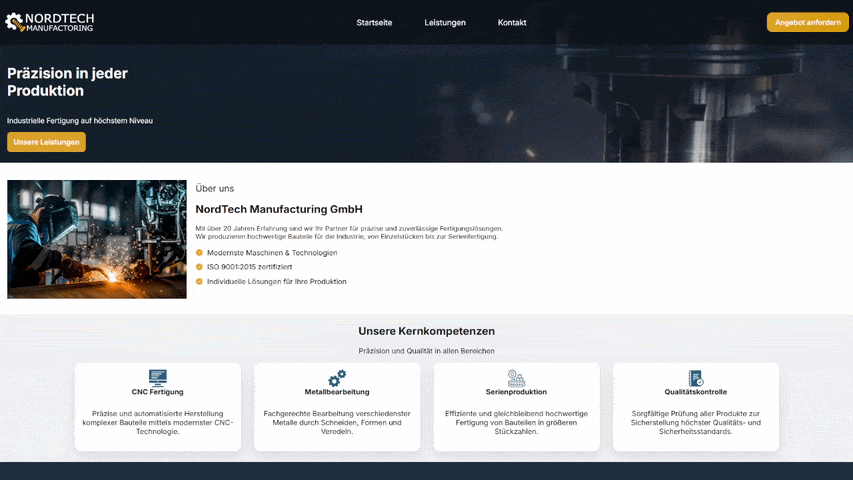
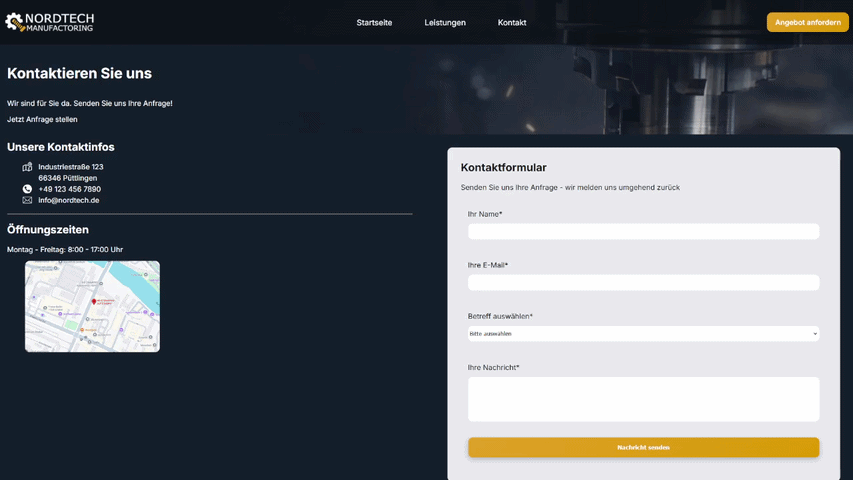
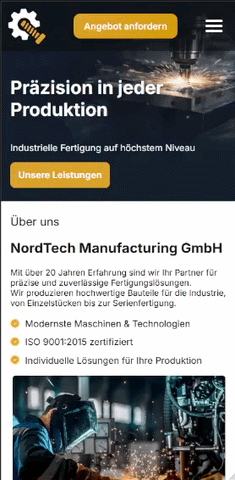

# Nordtech Manufacturing

## Projektübersicht
Link: https://audiosonic.github.io/Nordtech-Manufactoring/index.html  

Nordtech Manufacturing ist eine fiktive industrielle Webanwendung, die im Rahmen eines Lern- und Portfolioprojekts entwickelt wurde. Ziel ist die Präsentation eines modernen Industrieunternehmens im Web.

Die Anwendung simuliert eine Unternehmenswebsite mit Fokus auf Leistungsdarstellung, Produktkommunikation und Markenauftritt.

## Ziel des Projekts

Das Projekt dient der praktischen Umsetzung von Frontend- und Backend-Kenntnissen in einer realistischen Unternehmensumgebung.

Schwerpunkte
- Strukturierte Webanwendungsarchitektur
- Modernes, responsives UI/UX Design
- Mobile-First Entwicklung
- Simulation typischer Industriepräsentationen

## Seitenstruktur

Die Anwendung besteht aus drei zentralen Seiten:

## Startseite
  
Die Startseite vermittelt den ersten Eindruck des Unternehmens. Sie enthält die Markenbotschaft, eine kurze Vorstellung sowie einen Überblick über Leistungen und Werte.

## Leistungen

Die Leistungsseite stellt die industriellen Kernbereiche von Nordtech Manufacturing dar. Sie visualisiert die angebotenen Services und Kompetenzen in strukturierter Form.

## Kontakt

Die Kontaktseite ermöglicht die direkte Anfrage an das Unternehmen und dient als zentrale Schnittstelle für potenzielle Kunden und Geschäftspartner.

## Mobile-First Ansatz  
  
Das gesamte Design wurde nach dem Mobile-First Prinzip entwickelt.
Die Darstellung wurde zuerst für mobile Endgeräte konzipiert und anschließend für größere Bildschirme erweitert.

## Technischer Aufbau

Frontend: HTML, CSS, JavaScript
Design: modern, industriell, clean UI

## Zielgruppe

Die Website richtet sich an potenzielle Kunden und Geschäftspartner im industriellen Umfeld. Sie dient der externen Unternehmensdarstellung und vermittelt einen professionellen Eindruck der Marke Nordtech Manufacturing.

## Status

Dieses Projekt ist ein Lern- und Portfolioprojekt und nicht für den produktiven Einsatz vorgesehen.

## Hinweise

Alle Inhalte sind fiktiv und dienen ausschließlich Demonstrationszwecken.
